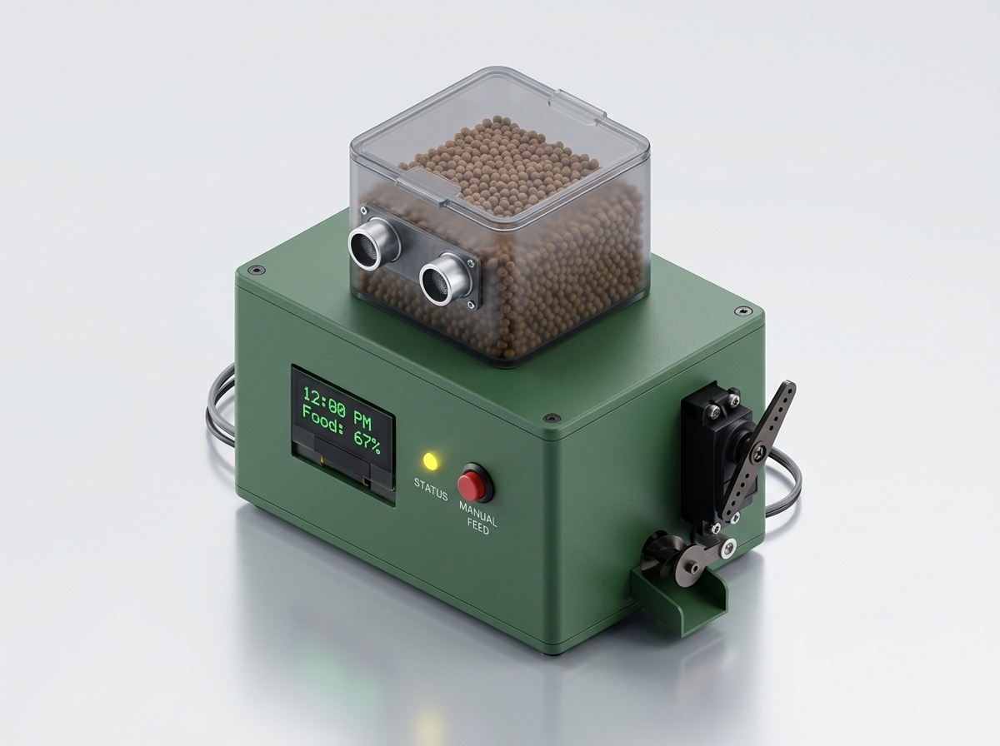
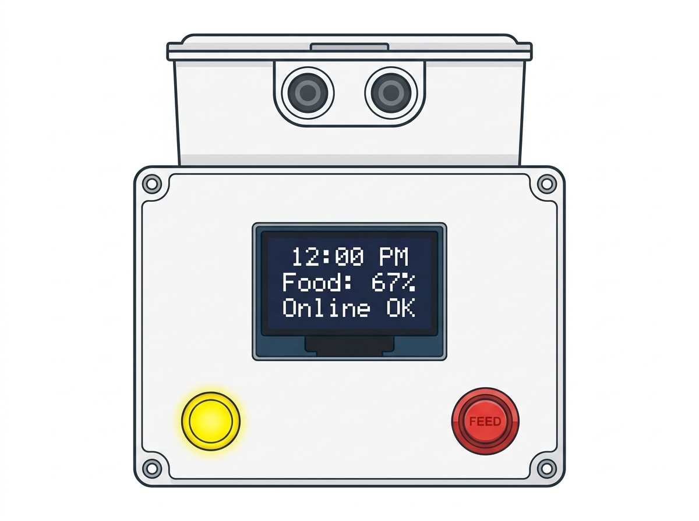
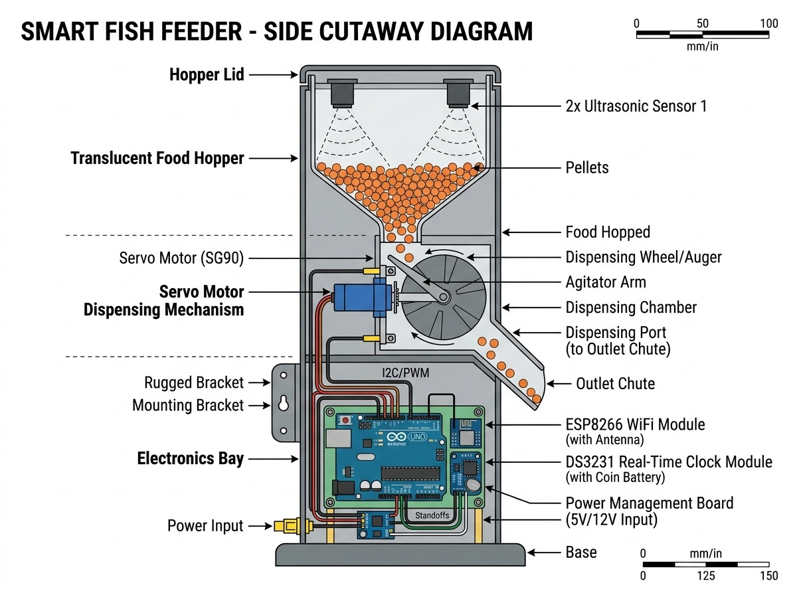

# AquaPulse Smart Fish Feeder

An automatic fish feeder built around an ESP32, controllable from a web
dashboard, with scheduled and manual feeding, live hopper level monitoring,
and remote status reporting over Firebase.

## Team Members

Department of Computer Science, Makerere University — Group 21

| Name | Student No. | Reg. No. |
|------|-------------|----------|
| MUTSINZI ALEX | 25/U/03480PS | 2500703480 |
| KAHUMA WALID | 25/U/26619 | 2500726619 |
| MUGABI ROBINSON | 25/U/03456/EVE | 2500703456 |
| NANFUUKA BONITAH | 25/U/03527/PS | 2500703527 |
| OKUJA EMMANUEL DILA JOHN | 25/U/28777/PSA | 2500728777 |

## Overview

A single ESP32 board runs the entire feeder: it drives a stepper motor to
turn an Archimedes screw that dispenses food, reads a DS3231 real-time clock
for scheduling, checks hopper level with an ultrasonic sensor, shows status
on a 16x2 LCD, and syncs everything to a Firestore database over WiFi. A
separate web app, hosted on Firebase Hosting, reads and writes to that same
database, giving live status and remote control from a phone or browser
anywhere with internet access, not just on the same network as the feeder.

## Architecture

```
┌─────────────────┐         ┌──────────────────┐         ┌─────────────────┐
│   ESP32 Feeder   │◄───────►│  Firebase         │◄───────►│   Web Dashboard  │
│                  │  WiFi   │  Firestore        │  HTTPS  │   (React app)    │
│  - Stepper motor │  HTTPS  │  (shared database) │         │                  │
│  - DS3231 RTC    │         │                    │         │  - Live status   │
│  - HC-SR04       │         │                    │         │  - Manual feed   │
│  - LCD + buzzer  │         │                    │         │  - Schedules     │
│  - Push button   │         │                    │         │  - History log   │
└─────────────────┘         └──────────────────┘         └─────────────────┘
```

The ESP32 and the web app never talk to each other directly. Both
independently read and write the same Firestore project, Firestore is the
shared source of truth. This means the feeder and the browser/phone using
the dashboard do not need to be on the same WiFi network.

## Hardware

| Component | Role |
|---|---|
| ESP32 DevKit | Main controller, WiFi, all logic |
| 28BYJ-48 stepper + ULN2003 driver | Turns the dispensing screw |
| DS3231 RTC | Keeps time for scheduled feeding, independent of WiFi/NTP |
| HC-SR04 ultrasonic sensor | Measures hopper fill level |
| 16x2 I2C LCD | On-device status display |
| Push button | Manual feed trigger |
| Piezo buzzer + LED | Local fault/alert indication |

Full wiring diagrams and pin maps are in `/docs/wiring-guide.md`.

### Power notes (read before wiring)

The stepper motor draws a real current spike when moving. Power it from a
supply source with adequate separation from the ESP32's own power path, a
shared, marginal rail can brown out the ESP32 mid-dispense. See the wiring
guide for details on how this was diagnosed and fixed during development.

## Project Design

### 3D Rendered View





### Side Cutaway — Internal Components




## Firmware

Location: `/firmware/AquaPulse_ESP32_Firmware.ino`

Key behaviors:
- Local hardware (button, stepper, LCD, sensor, scheduling) keeps working
  even if WiFi is down, only the Firestore sync pauses.
- The manual button uses a hardware interrupt rather than polling, so a
  press is never missed even while a blocking network call is in progress.
- Firestore commands are fetched with a server-side filter for
  `status == "pending"` rather than listing the whole collection, keeping
  read costs flat regardless of how much command history accumulates.
- Fault conditions (sensor failure, RTC failure) are reported as alerts on
  the LCD, LED, buzzer, and dashboard, but do not block manual feeding.

### Firmware setup

1. Arduino IDE, install the ESP32 board package (Boards Manager).
2. Install libraries: `ArduinoJson` (7.x), `RTClib`, `LiquidCrystal_I2C`.
3. Edit `WIFI_SSID` and `WIFI_PASSWORD` near the top of the sketch.
4. Select your board under Tools > Board > esp32 (generic boards work with
   "ESP32 Dev Module").
5. Flash, then open Serial Monitor at 115200 baud to confirm WiFi connects
   and both the RTC and LCD initialize.

## Web dashboard

Location: `/dashboard`

React + TypeScript + Vite, talking directly to Firestore client-side, no
separate backend server.

### Dashboard setup

```
cd dashboard
npm install
npm run dev
```

### Deploying

```
npm run build
firebase deploy
```

See `/dashboard/README.md` for full deployment instructions.

## Firestore schema

```
devices/feeder_01
├── connectivity: string
├── lastCommunication: timestamp
├── healthSummary: string
├── capacity: number (0-100)
├── lastFeedTime: timestamp
├── lastFeedQuantity: number
└── health
    ├── esp32Board: { responding, uptime }
    ├── network: { wifiSignal, networkStatus, ipAddress }
    ├── buttons: { lastPressed, functional }
    ├── lcdScreen: { working, lastMessage }
    ├── ultrasonicSensor: { working, lastMeasuredLevel }
    ├── rtcModule: { synced, deviceTime }
    └── stepperMotor: { status, lastActuation, configuredSpeed }

devices/feeder_01/commands/{id}
├── action: "feed" | "reboot" | "selftest"
├── portion: number (only for "feed")
└── status: "pending" | "done"

devices/feeder_01/history/{id}
├── quantity: number
├── source: "manual_button" | "manual_app" | "scheduled"
├── timestamp: timestamp
└── status: string

devices/feeder_01/schedules/{id}
├── time: string ("HH:MM")
├── enabled: boolean
├── portion: number
└── days: string[]
```

## Security note

Firestore rules are currently open (`allow read, write: if true`), suitable
for a personal/demo project, not for production or public deployment.
Anyone with the project ID could read or control the feeder. Before wider
deployment, add Firebase Authentication and lock the rules down to
authenticated users.

## Design decisions worth knowing about

- **"Online" status is computed client-side from recency, not stored
  state.** A powered-off device can't write "offline" itself, so the
  dashboard treats the feeder as offline if it hasn't reported in within
  ~25 seconds, regardless of the last value it wrote.
- **No watchdog timer.** One was tried during development and caused an
  unexplained restart loop unrelated to any connected hardware. Removed
  rather than risk reintroducing that failure mode.
- **Firestore command polling uses a filtered query, not a full collection
  listing.** This was a real bug during development, an unfiltered query
  re-reads every historical "done" command on every single poll, which
  will exhaust the free tier's daily read quota as usage history grows.

## Project history

This started as a two-board design (Arduino Uno + ESP8266 bridge board)
and was later consolidated onto a single ESP32 to simplify wiring and
remove a fragile serial link between two boards. Some field names in the
Firestore schema and code comments may still reference that transition.
